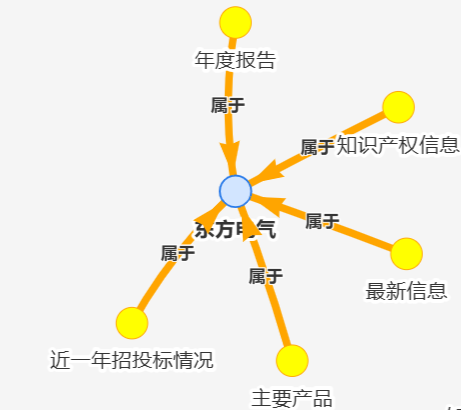
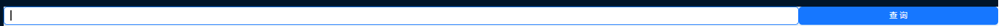
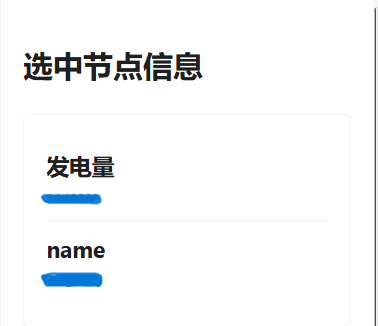

# Based on React+Neovis.js Knowledge Graph Visualization Example



## What is this thing?

This repo is based on [react-neovis-example](https://github.com/jackdbd/react-neovis-example).I added some functions to make the graph more user-friendly.All the added features are listed below:

- Add the arrow and let the node display the name of the node.
- Add a search bar so users can input cypher query to search for specific information.
- Add the function that users can click the node to see the detail of the node.
- Add the button so users can click to run different cypher queries.

## How to use it?

As you are new to neo4j, you can follow the steps below to create a neo4j sandbox and run the project.

1. create a Neo4j Sandbox on [neo4j.com](https://neo4j.com/sandbox/),
2. install the project dependencies,
3. connect to your Neo4j Sandbox.

### 1 - Create a Neo4j Sandbox

A Neo4j Sandbox is essentially a Docker container with Neo4j installed, and a graph dataset that you can play with. There is nothing to install. It runs on the cloud. A Sandbox will expire in 3 days, but if you want you can extend your project for an additional 7 days (it can be done only once).

Create a Neo4j Sanbox [here](https://neo4j.com/sandbox/).


### 2 - Install project dependencies

```sh
git clone https://github.com/xgh127/Knowledge_Graph.git
cd Knowledge_Graph
npm install  # or simply, npm
```

### 3 - Connect to your Neo4j Sandbox

Find the `Connection details` for your Neo4j Sandbox:


Then open the [App component](src/App.js) and replace the following lines with your own credentials:

```js
const NEO4J_URI = "YOUR_NEO4J_BOLT_URL";
const NEO4J_USER = "YOUR_NEO4J_USERNAME";
const NEO4J_PASSWORD = "YOUR_NEO4J_PASSWORD";
```

Please neglect my connection details.

### 4 - Run the project

```sh
npm start
```

The project will be running on `http://localhost:3000/react-neovis-example/`.

## Other ways to run the project

If you have already installed neo4j locally, you can also run the project by replace the corresponding lines in the [App component](src/App.js) with your own credentials.

## Contact me

If you have any questions, please feel free to contact me at <EMAIL> which is on my profile.
